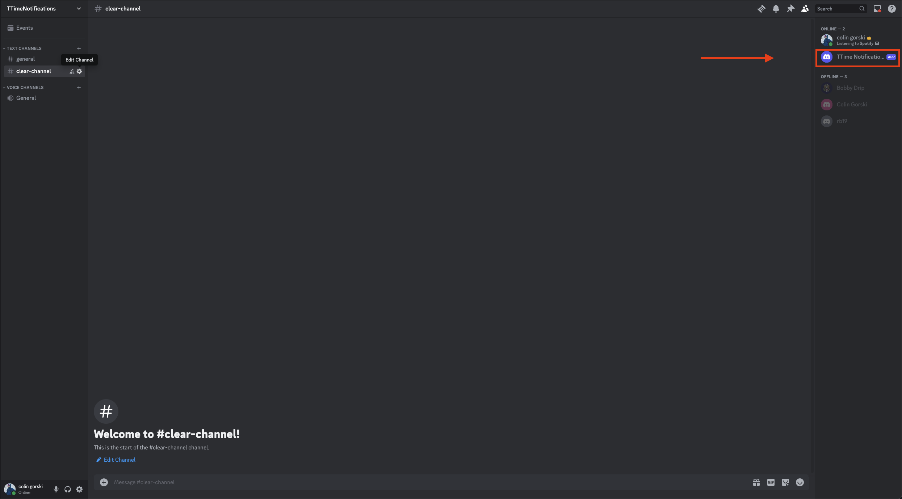

# How to Connect Your Account to the Discord Bot

Follow these instructions to connect your ForeAdvantage account to the Discord bot. These steps are designed to be as clear as possible for users who may not be familiar with Discord.

Connecting your account to discord will allow you to be notified when tee times become available. I highly reccomend downloading the app in order to get the notification if you are away from your computer.

## Step 1: Join the Discord Server

1. **Log in to Your ForeAdvantage Account**:

   - If you don't have an account, then you will have trouble with this guide.

2. **Navigate to Settings**:

   - Go to the settings page of your ForeAdvantage account.

3. **Click "Conect Discord"**:

   - This pop up will contain the information you need in order to join the server.

4. **Join the Discord Server**:

   - Follow the prompts to join the Discord server. You must be in this server to allow the bot to message you.
   - You can mute this server so you won't get notified of others joining, but you must be in the server.

5. **Find the Bot in the Members of the Server**:
   - Look at the right sidebar in Discord to see the server members. Find you can see the bot named `TTimeBot`, as shown in the image below.
     

## Step 2: Verify via Private Message (DM)

1. **Mute the Server (Optional)**:

   - You can mute the server notifications, but do not leave the server. Being in the server enables the bot to message you.

2. **Open a Private Chat with the Bot**:
   - Click on `TTimeBot` from the right sidebar to open a private chat.
   - Send a message to the bot to create a private chat. The content of the first message can be anything.

## Step 3: Generate and Use the Verification Code

1. **Generate Code**:

   - Go back to the ForeAdvantage settings menu.
   - Click the "Generate Code" button in the connect to Discord settings section.

2. **Copy the Code**:

   - Click the copy button to copy the generated code to your clipboard.

3. **Send Verification Command**:
   - Return to your private chat with `TTimeBot` in Discord.
   - Type `/verify` in the chat. The command should autocomplete.
   - Paste your copied code after the `/verify` command.
   - Send the message. If successful, you should receive a confirmation response from the bot.

## Step 4: Finalize the Connection

1. **Log Out and Log Back In**:
   - Log out of your ForeAdvantage account.
   - Log back in to ensure the changes take effect.

By following these steps, your ForeAdvantage account should now be successfully connected to the Discord bot. If you encounter any issues, please refer to the support section on the ForeAdvantage website for further assistance.
